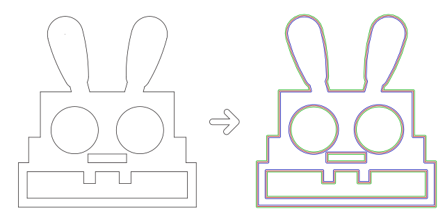

Laser Offset
============

Simple Tools that creates external and internal offsets for shapes. Supports DXF and SVG Import/Export.

    This project is in early alpha and was created as side-project for hobby.



Installing
----------

Install and update using `pip`_:

```

    $ pip install -U laser_offset

```

Usage
-----

```

    Usage: laser_offset [OPTIONS] SOURCE_PATH TARGET_PATH LASER_WIDTH

    Creates new drawings from DXFs with outer and inner offset lines by
    LASER_WIDTH in μm(microns) ans save them into TARGET_PATH as SVG or DXF.

    SOURCE_PATH is folder with DXFs for batch convertion

    TARGET_PATH is folder for results

    LASER_WIDTH is beam diameter in μm(microns) from 1 to 999

    Options:
    -s, --svg                 Output as SVG  [default: (False)]
    -d, --dxf / -D, --no-dxf  Output as DXF  [default: (True)]
    --help                    Show this message and exit.

```

**Example:**

`laser_offset . ./output -s 150`

Limitations
-----------

1. Can't handle arcs less that half of laser width
2. Ignores layers, text, shape size and styles
